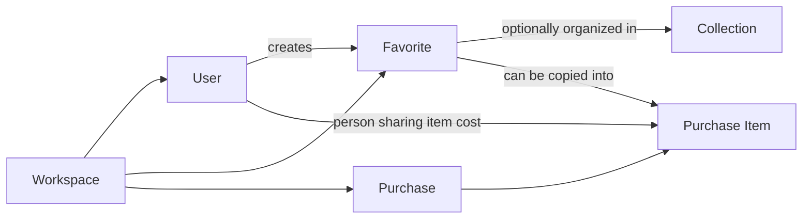
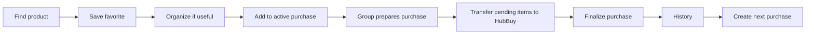

# Product

## Name

**Loti**

Short, easy to read/pronounce in Brazil and intentionally broad enough to outlive the China-import use case if the product evolves.

## One-sentence definition

> Loti is a private collaborative web app where a small group organizes personal product favorites and assembles a shared purchase without spreadsheet copy/paste.

## Initial users

The initial workspace contains five trusted members:

- Gabriel
- Brunna
- Amanda
- Bola
- Vinicius

The implementation must not hardcode these identities into domain logic. They are seed/migration data only.

## Core mental model

### Workspace

The private shared boundary. The MVP exposes only one workspace in the UI, but data should still be workspace-scoped.

### Favorite

A product one person wants to keep for later. A favorite is personal in ownership but visible to the whole workspace.

### Collection

A personal folder for organizing favorites, e.g. `Presentes`, `Build PC`, `Tênis`. A favorite belongs to zero or one collection in the MVP.

### Purchase

One collective buying round, e.g. `Compra Outubro/2026`. Only one can be active at a time.

### Purchase Item

A concrete physical item inside a purchase. It is an immutable-history-friendly snapshot of product data and may originate from a favorite or be created manually. One item may have cost shares assigned to several workspace members; it remains one physical row and one quantity in the purchase. See [the purchase cost-sharing plan](20_PURCHASE_COST_SHARING_PLAN.md).

## Primary product loop

## UX principles

1. **Faster than a spreadsheet.** Common actions must require very few steps.
2. **Mobile-first behavior, responsive web implementation.** Links are often discovered on a phone.
3. **Show only what is needed now.** Progressive disclosure instead of admin-style forms.
4. **One shared place, clear ownership.** Data ownership must never depend on a sheet/tab name.
5. **Purchases are historical records.** Current favorite edits never rewrite the past.
6. **Consumer app, not dashboard.** Avoid decorative metrics and enterprise density.
7. **Predictable collaboration.** Favorites are personal; purchases are collective.
