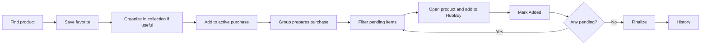

# User Flows

These are the canonical human journeys. Optimize implementation for the common path and keep secondary fields behind progressive disclosure where useful.

## Macro journey

## 1. Login

`Open app → Email/password → Authenticate → Favorites`

- no onboarding;
- no workspace setup wizard;
- authenticated users land on Favorites;
- desktop presents the editorial community-orbit scene beside the form; tablet/mobile use a compact scene above it;
- email/password focus and submitting get subtle scene feedback; Enter, inline errors and loading retain their behavior;
- reduced motion shows a static equivalent; no illustration delays authentication or redirect. See `17_LOGIN_ORBITAL_MOTION.md`.

## 1a. Edit profile

`Avatar → Perfil → edit name → Save`

- the complete display name is shared across the member's workspaces; email stays read-only;
- the profile updates immediately in the current app session and persists through reload/login;
- `Segurança → Alterar senha → current password + new password + confirmation → Save`;
- successful password change preserves this device's session and ends all other sessions;
- cancellation clears password fields; a lost/uncertain response never triggers an automatic retry.

## 2. Create favorite

`Copy external link → Open Loti → + New favorite → Paste URL → Type name → optional price/details → Save`

Minimum useful form: URL + name.

## 3. Duplicate warning

`Paste URL → normalize/canonicalize → possible match found → show existing item → choose “Ver existente” or “Salvar mesmo assim”`

Never hard-block.

## 4. View favorites

`Favorites → Todos or Meus → list/cards`

Default sort: newest first. Both modes use small decorative category markers; name, variation, price, owner, platform and actions dominate. Cards have no large image header.

## 5. Find a favorite

`Favorites → Search → optional filters → result`

Filters can combine: person + platform + collection + QC + price presence.

## 6. Open favorite

`Select favorite → detail surface → Abrir produto OR + Compra`

Owner also sees Edit/Delete.

## 7. Edit favorite

`Open own favorite → Edit → change allowed fields → Save`

Historical purchase items remain unchanged.

## 8. Delete favorite

`Open own favorite → Delete → confirm → favorite removed`

Existing purchase items remain.

## 9. Create collection

`Favorites → + Nova coleção → Name → Create`

No color/icon/description setup in MVP.

## 10. Put favorite in collection

`Create/Edit favorite → choose collection → Save`

Zero or one collection.

## 11. Navigate collection

`Favorites → select collection → list is filtered`

Collections behave like personal organizational folders integrated into Favorites.

## 12. Delete collection

`Collection menu → Delete → confirm → favorites become uncollected`

## 13. Create first/next purchase

`Compra atual → empty state → Criar compra → suggested month/year name → optional HubBuy email → Save`

Block if another purchase is already active.

## 14. Favorite → purchase

`Favorite → + Compra → owner defaults as sole participant → optionally select participants and split mode → preview personal shares and physical subtotal → Add`

Creates a snapshot.

## 15. Add manual purchase item

`Compra atual → + Adicionar item → Manual → name + URL + participant(s) → optional equal/percentage/fixed split → preview → Add`

Does not create a favorite.

## 16. Add from favorites inside purchase

`Compra atual → + Adicionar item → Dos favoritos → search → select one → adjust purchase-specific fields → Add`

One at a time in MVP. The picker uses the same compact category markers.

## 17. View active purchase

`Compra atual → physical overall summary and progress → personal share summaries → the same physical items grouped under every selected participant`

Immediately answer: what, for whom, how much, and what is still pending. Category markers remain smaller and quieter than the pending/added control.

## 18. Edit purchase item

`Open active item → Edit → change participants/mode/shares and variation/quantity/price/notes → preview → Save → derived totals refresh for everyone`

Does not mutate favorite.

## 19. Change quantity

`Edit item → quantity 1 → N → save → physical subtotal, allocated shares and overall progress recompute; fixed shares need review`

## 20. Item without price

`Add/edit item with empty price → Save → display Preço pendente → totals show priced amount + count of no-price items`

## 21. Actual buying day

`Compra atual → Pendentes → Open product → add it to the current HubBuy account → return → mark Added → next pending`

This is a first-class operational workflow.

## 22. Mark Added

`Pending checkbox/status → tap once → Added`

No confirmation modal.

## 23. Finalize purchase

`Finalize → check pending/no-price warnings → confirm → status finalized → move to history`

Warnings do not block.

## 24. View history

`Histórico → finalized purchases newest first → select one`

Show name/date/people/units/total.

## 25. Open historical purchase

`History item → purchase detail read-only`

Reuse current-purchase visual language and small category markers but remove all mutation affordances. Category display comes from snapshot `visual_key`.

## 26. Start next cycle

`Purchase finalized → Compra atual empty state → Criar próxima compra → cycle restarts`

## 27. Packages and costs

`Finalize purchase → financial follow-up opens automatically → correct effective prices/China freight → allocate units to packages → enter Brazil freight/customs → confirm external charges manually → close financial follow-up`.

Older finalized purchases expose an explicit **Iniciar custos** action. A follow-up may remain open after the next purchase starts. Closing it leaves purchase history immutable; a correction uses **Reabrir custos**, confirmation and a reason. Full states, allocation and payment rules: [Packages and costs plan](21_PACKAGES_AND_COSTS_PLAN.md).

## Mobile quick-save mental model

`WhatsApp/Reddit/marketplace → copy URL → Loti → + → paste URL → name → save`

The UI must not force users through nested navigation for this action.

## Invite someone to the group

`Avatar → Perfil → Meu grupo → Convidar pessoa → Email → Gerar link → Copiar/Compartilhar`.

`Shared link → invited email and group → name/password/confirmation → account and membership → Favorites`.

Existing account: `Shared link → Entrar para aceitar → login → return to invite → Aceitar convite → Favorites`. Wrong-email session: `Trocar de conta → login with invited email → accept`.

Pending invitations offer explicit regeneration (invalidates old link) or confirmed revocation. Links expire in seven days. Invalid/expired/revoked/used links explain the problem and direct the person to request a new link. Session failure after signup directs the person to normal login with their newly defined password.
