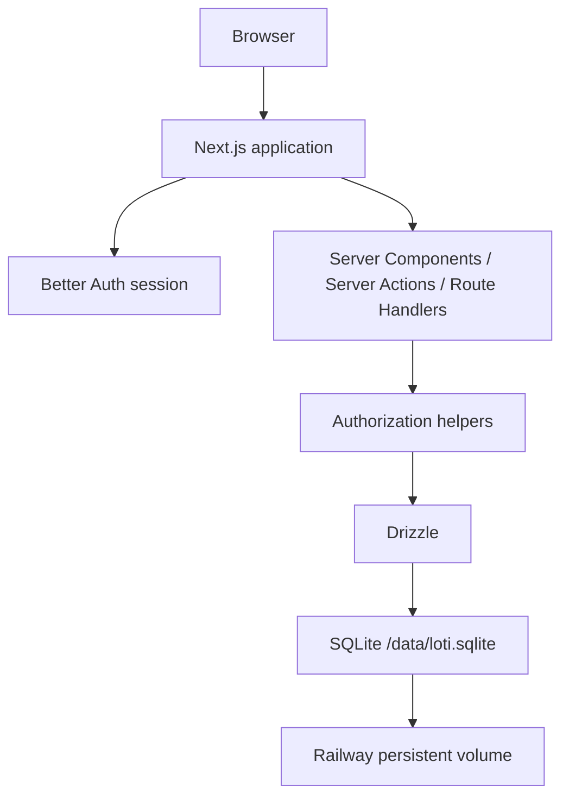

# Technical Architecture

## Canonical stack

- **Next.js** — full-stack web application
- **TypeScript** — strict mode
- **Tailwind CSS**
- **shadcn/ui** — component foundation, visually customized to Loti
- **Better Auth** — private email/password authentication
- **Drizzle ORM**
- **SQLite** via `better-sqlite3`
- **Zod** — validation
- **React Hook Form** — form UX where useful
- **Playwright** — E2E
- **Railway** — production host
- **Railway Persistent Volume** — SQLite persistence

Use current stable package versions compatible with Node 24 LTS unless the existing repository already establishes another supported runtime.

## Runtime model



## Security boundary

The browser never connects directly to SQLite.

All mutations and sensitive reads go through server-side application code that:

1. resolves the current Better Auth session;
2. verifies workspace membership;
3. applies ownership/purchase-state rules;
4. validates input using Zod;
5. executes Drizzle queries/transactions.

No RLS is required because the database is not exposed as a browser data API.

## Central authorization helpers

Implement and reuse helpers conceptually equivalent to:

- `requireUser()`
- `requireWorkspaceMember()`
- `requireFavoriteOwner()`
- `requireCollectionOwner()`
- `requireActivePurchase()`
- `requireEditablePurchase()`

Do not duplicate authorization conditionals across random UI/actions.

## Better Auth

- email + password only in MVP;
- public signup UI disabled;
- sessions stored in the same SQLite database;
- operator tooling creates users;
- production passwords/emails are human input, never hardcoded.

## Project organization

Recommended shape:

```text
src/
  app/
    (auth)/login/
    (app)/favorites/
    (app)/purchase/
    (app)/history/
    (app)/profile/
  components/
    ui/
    layout/
    favorites/
    purchase/
    shared/
  features/
    favorites/
    collections/
    purchases/
  lib/
    auth/
    db/
    money/
    urls/
    validation/
    product-visuals/
  types/

scripts/
  create-user.ts
  seed.ts
  import-legacy-spreadsheet.ts

public/
  product-visuals/
```

Adapt if Next.js conventions or generated Better Auth files require slight differences, but preserve separation of concerns.

## Domain mutations

Prefer small domain-oriented actions/functions:

### favorites

- createFavorite
- updateFavorite
- deleteFavorite

### collections

- createCollection
- renameCollection
- deleteCollection

### purchases

- createPurchase
- updatePurchaseMetadata
- finalizePurchase

### purchase items

- addFavoriteToPurchase
- addManualPurchaseItem
- updatePurchaseItem
- removePurchaseItem
- togglePurchaseItemCartStatus

## Validation

Validate at the server boundary even if the client already validates. Shared Zod schemas are encouraged when it improves consistency.

## Money

Use integer cents in persistence and arithmetic. Centralize parsing/formatting helpers for BRL display.

## URL handling

Centralize:

- `detectPlatform(url)`
- `normalizeProductUrl(url)` and/or `buildCanonicalProductKey(url)`

Preserve original URLs.

## Search

For MVP scale, SQLite case-insensitive matching is sufficient. Do not add Algolia/Meilisearch/Elasticsearch. FTS may be considered later only if needed.

## Realtime

Not part of MVP. After mutations, revalidate/refetch appropriate server data. Do not add websockets or realtime subscriptions.

## Application replicas

Production must run **one replica** while using a local SQLite file. Horizontal scaling is a future migration trigger, not an MVP requirement.
