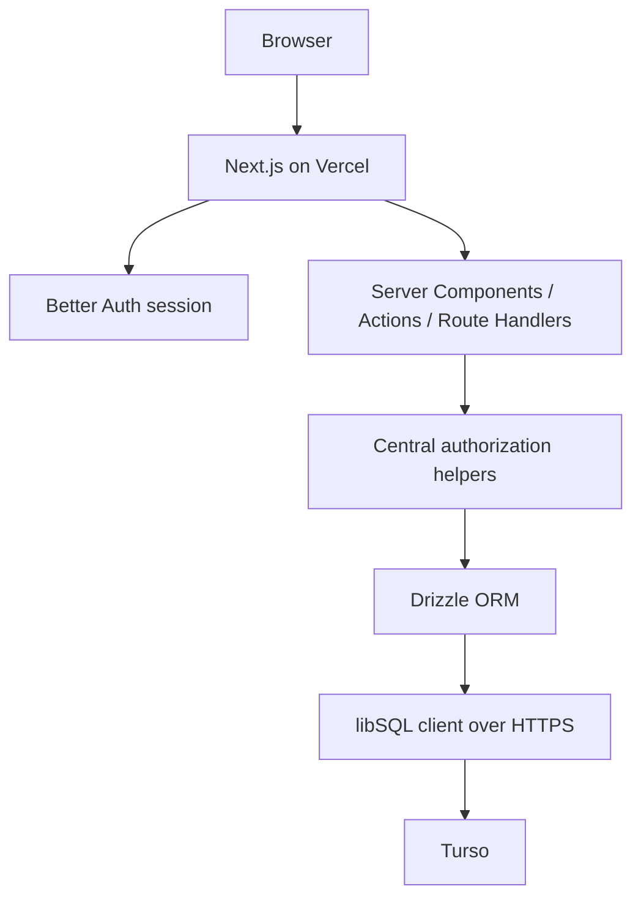

# Technical Architecture

## Canonical stack

- **Next.js** — full-stack web application
- **TypeScript** — strict mode
- **Tailwind CSS** and **shadcn/ui**
- **Better Auth** — private email/password authentication
- **Drizzle ORM** — SQLite schema dialect
- **Turso/libSQL** — remote SQLite-compatible database
- **`@libsql/client`** — server-side database driver
- **Zod**, **React Hook Form**, and **Playwright**
- **Vercel** — production hosting and Git-based deployments

Keep the stable package versions pinned by the repository. Do not upgrade to RC/latest releases solely to match an example.

## Runtime model



Browser code never receives a database connection or Turso credentials. Application routes use asynchronous database operations.

## Security boundary

All sensitive reads and mutations go through server-side application code that:

1. resolves the current Better Auth session;
2. verifies workspace membership;
3. applies ownership and purchase-state rules;
4. validates input using Zod;
5. executes Drizzle queries against Turso.

No RLS is required because the database is not exposed as a browser data API.

## Central authorization helpers

Implement and reuse helpers conceptually equivalent to:

- `requireUser()`
- `requireWorkspaceMember()`
- `requireFavoriteOwner()`
- `requireCollectionOwner()`
- `requireActivePurchase()`
- `requireEditablePurchase()`

Do not duplicate authorization conditionals across random UI/actions.

## Better Auth

- email + password only in MVP;
- public signup UI and endpoint are disabled;
- sessions use the same Turso database;
- operator tooling creates users;
- production passwords/emails are human input, never hardcoded;
- the Drizzle adapter remains configured with `provider: "sqlite"`.
- profile edits reuse Better Auth's `/update-user` and `/change-password` endpoints, with path-scoped server hooks that validate trusted origin, authoritative session, workspace membership and strict payloads;
- password hooks enforce 12–128 characters, reject immediate reuse and force `revokeOtherSessions: true`; Better Auth owns verification, hashing, persistence and cookie rotation.

`BETTER_AUTH_URL` must equal the deployed HTTPS origin. Keep `BETTER_AUTH_SECRET` server-only. Vercel preview environments should use the development database and matching preview URL configuration where sign-in is needed.

## Database runtime

The application creates one reusable libSQL client and Drizzle instance per server process. Runtime credentials are `TURSO_DATABASE_URL` and `TURSO_AUTH_TOKEN`; neither receives a `NEXT_PUBLIC_` prefix. Production has no dependency on a writable filesystem or `better-sqlite3`.

Local development and isolated tests can use `@libsql/client` with a local file URL or in-memory database. The schema, constraints, IDs, integer-cent money, category keys and purchase snapshots stay SQLite-compatible.

## Migrations

`src/lib/db/schema.ts` remains the source of truth. Keep the versioned migrations in `drizzle/` and use the libSQL migrator. Apply migrations explicitly with `npm run db:migrate` against the selected database before deployment. Do not put migrations in a route handler, middleware, server component, or request startup path.

## Project organization

```text
src/
  app/
    (auth)/login/
    (app)/favorites/
    (app)/purchase/
    (app)/history/
    (app)/profile/
  components/
    ui/
    layout/
    favorites/
    purchase/
    product-category-icons/
  features/
    favorites/
    collections/
    purchases/
  lib/
    auth/
    db/
    money/
    urls/
    validation/
    domain/categories.ts

scripts/
  create-user.ts
  seed.ts
  import-legacy-spreadsheet.ts

public/
  login-stories/
```

Adapt if Next.js conventions or generated Better Auth files require slight differences, but preserve separation of concerns. Operational item markers render inline SVG via `ProductCategoryMarker`; `resolveProductCategory()` derives category keys stored in existing `visual_key` fields. No product render assets or image API. Editorial login assets remain independent. See `07_PRODUCT_VISUALS.md`.

## Domain mutations

Prefer small domain-oriented actions/functions:

### favorites

- createFavorite
- updateFavorite
- deleteFavorite

### collections

- createCollection
- renameCollection
- deleteCollection

### purchases

- createPurchase
- updatePurchaseMetadata
- finalizePurchase

### purchase items

- addFavoriteToPurchase
- addManualPurchaseItem
- updatePurchaseItem
- removePurchaseItem
- togglePurchaseItemCartStatus

## Validation and money

Validate at the server boundary even if the client already validates. Use integer cents for money and centralize parsing/formatting helpers for BRL display.

## URL handling and search

Centralize `detectPlatform(url)`, `normalizeProductUrl(url)` and/or `buildCanonicalProductKey(url)`. Preserve original URLs. For MVP scale, SQLite-compatible case-insensitive matching is sufficient; do not add a separate search service.

## Realtime and scaling

Realtime is not part of the MVP. After mutations, revalidate/refetch appropriate data. Vercel can run multiple stateless application instances because persistent state lives in Turso; do not add local-file coordination or application volumes.

## Invitation boundary

`src/lib/domain/invitations.ts` centralizes issuance, inspection, acceptance, regeneration and revocation. `/api/group` requires session/membership; `/api/invitations/[token]` permits token-validated public inspection/acceptance. Mutations check configured auth origin. Public signup stays disabled. Account creation uses a server-only operator-configured Better Auth instance bound to the Drizzle transaction with auto sign-in disabled. The transaction includes account/credential, membership, active workspace selection and invitation consumption. After commit, the browser establishes its session through the normal Better Auth login endpoint.

Tokens contain 32 random bytes; only SHA-256 hashes persist. No token/body logging is added by application code. Responses use no-store; the invitation page uses no-referrer and noindex. Infrastructure access-log retention/redaction must account for token-bearing paths. Persistent fixed-window minute limits are shared across instances: 15 management mutations per user, 240 public inspections globally, 60 accepts globally, 10 attempts per valid token. Limiter entries older than one hour are removed during requests.
